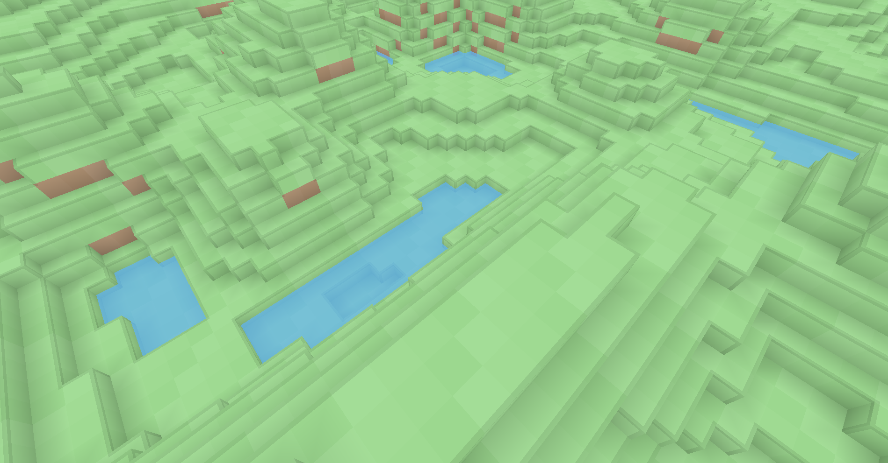

# Rutile

Rutile is a small user-space graphics API with explicit runtime backend loading.
Applications load a backend such as Vulkan or DirectX 12 at startup, and can
insert layers for validation, logging, profiling, or other interception work.

The public API is currently a C binding. Other language bindings are possible,
but are not implemented yet.

## Platform Status

- Windows MSVC: builds and tests the Vulkan backend, DirectX 12 backend,
  validation layer, logging layer, RTSL compiler, and RTSL tests.
- Windows Clang and Windows GCC: build and test portable compiler coverage with
  backends disabled and layers/tests enabled.
- Linux GCC and Linux Clang: build and test portable compiler coverage with
  backends disabled and layers/tests enabled.
- macOS: build and test setup is present with backends disabled. macOS backend
  compilation is intentionally not enabled yet.

## Requirements

Common requirements:

- CMake 3.28 or newer
- Ninja
- Git submodules checked out recursively
- vcpkg with `VCPKG_ROOT` pointing at the vcpkg checkout

Windows requirements:

- Visual Studio 2022 with the **Desktop development with C++** workload
- Vulkan SDK if building `rt-vulkan`
- DirectX Shader Compiler dependency is pulled through vcpkg when using the
  `directx12` manifest feature

Linux requirements:

```sh
sudo apt-get update
sudo apt-get install -y \
  libgl1-mesa-dev \
  libx11-dev \
  libxcursor-dev \
  libxi-dev \
  libxinerama-dev \
  libxrandr-dev \
  libc++-dev \
  libc++abi-dev \
  ninja-build \
  xorg-dev
```

macOS requirements:

```sh
brew install ninja
```

The GitHub macOS runner is arm64, so the CI preset uses the `arm64-osx` vcpkg
triplet.

## Build And Test

The CI-equivalent Windows MSVC build is:

```bat
cmake --preset windows-ci
cmake --build --preset windows-ci --parallel
ctest --preset windows-ci
```

That builds `rt-vulkan`, `rt-directx12`, `rt-validation-layer`, `rt-logging-layer`,
`rtsl-tests`, `rtsl-sdk-tests`, and `rtslc`.

The normal Windows debug build is:

```bat
cmake --preset windows-debug
cmake --build --preset windows-debug --parallel
ctest --preset windows-debug
```

The repository script also enters the MSVC x64 developer environment and uses
the static `x64-windows-static` triplet:

```bat
scripts\build.bat Debug
```

Windows compiler coverage:

```bat
cmake --preset windows-clang-ci
cmake --build --preset windows-clang-ci --parallel
ctest --preset windows-clang-ci

cmake --preset windows-gcc-ci
cmake --build --preset windows-gcc-ci --parallel
ctest --preset windows-gcc-ci
```

Linux compiler coverage:

```sh
cmake --preset linux-ci
cmake --build --preset linux-ci --parallel
ctest --preset linux-ci
```

For Linux Clang, use libc++ so `<expected>` is available with C++23:

```sh
CC=clang CXX=clang++ CXXFLAGS=-stdlib=libc++ LDFLAGS=-stdlib=libc++ cmake --preset linux-ci
cmake --build --preset linux-ci --parallel
ctest --preset linux-ci
```

macOS setup build:

```sh
cmake --preset macos-ci
cmake --build --preset macos-ci --parallel
ctest --preset macos-ci
```

## vcpkg Features

The vcpkg manifest is split into features so optional dependencies stay behind
the targets that use them:

- `vulkan`: Vulkan backend dependencies
- `directx12`: DirectX 12 backend dependencies
- `opengl`: OpenGL 3.3 backend dependencies
- `examples`: GLFW, GLM, CLI11, and stb for examples
- `tests`: Catch2 and test CLI support

For example, use `windows-core` for a headers/layers-only configure and
`windows-vulkan-examples` for the Vulkan examples.

## Run Examples

Build the examples and run them against the Vulkan backend:

```bat
scripts\test-examples.bat Debug out\build\examples rt-vulkan
```

Run the built examples manually from the build output directory:

```bat
out\build\examples\bin\rutile-01-triangle.exe --backend rt-vulkan
out\build\examples\bin\rutile-05-voxel-renderer.exe --backend rt-vulkan --frames 300
```

If you use a multi-config generator, the executables are under
`out\build\examples\bin\Debug` instead.

`scripts\test.bat Debug` configures, builds, and runs the test tree with CTest.
It returns an error if configuration fails, compilation fails, a test fails, or
no tests are registered.

Here is a screenshot from the voxel renderer.
<p align="center">
  
</p>

## Project Shape

- `bindings/c/include/rutile.h` is the public loader and core API.
- `bindings/c/include/rt_ext_*.h` files are optional extension packages.
- `rt-vulkan` is the Vulkan backend.
- `rt-directx12` is the DirectX 12 backend (Windows only).
- `rt-validation-layer` is a validation layer.
- `rt-logging-layer` is a logging layer.
- `examples` is a collection of small projects that show how to use Rutile. All examples use RTSL shaders and can be built and run with `scripts\test-examples.bat`.

## Loading

Applications load a backend by name, optionally with layers:

```c
const char* layers[] = {
    "RT_VALIDATION_LAYER",
    "RT_LOGGING_LAYER",
};
if (rtLoad("rt-vulkan", layers, 2) != RT_SUCCESS) {
    /* handle load failure */
}
```

After `rtLoad` and `rtInit`, extension headers can resolve their own procs and initialize extension state against the current context:

```c
const char* features[] = { RT_FEATURE_PRESENTATION };
rtInit(features, 1);

if (rtLoad_RT_EXT_SWAPCHAIN() != RT_SUCCESS) {
    /* the loaded backend/layer chain does not expose the swapchain extension */
}

if (rtLoad_RT_EXT_GLFW() != RT_SUCCESS) {
    /* the extension exists but the current context may not support it */
}
```

For ad-hoc feature checks, ask the loaded chain for a proc:

```c
if (rtGetProc("rtMyFeatureDoThing")) {
    /* the loaded chain exposes this feature */
}
```

## Extensions

Rutile extensions are functions exported by a backend that are not part of the core.
These features should come with headers declaring what functions are exposed and what
to load.

These headers contain things like:
- public extension types
- proc typedefs
- private proc slots
- inline API wrappers
- a function (like `rtLoad_EXT_SWAPCHAIN`) that resolves names through `rtGetProc`


The application includes the extension header and loads it after the backend and core context are initialized:

```c
#include "rt_ext_my_feature.h"

rtLoad("rt-vulkan", layers, layer_count);
rtInit(features, feature_count);

if (rtLoad_RT_EXT_MY_FEATURE() == RT_SUCCESS) {
    rtMyFeatureDoThing(...);
}
```

This is one of Rutile's core philosophies: features should be able to be screwed onto forked backends 
with ease.

## Layers
Layers are a feature that enable easy cross platform validation, logging, profiling or other features
enabled by intercepting calls. For example the official validation layer tracks object lifetimes and
errors when things remain alive at termination.
