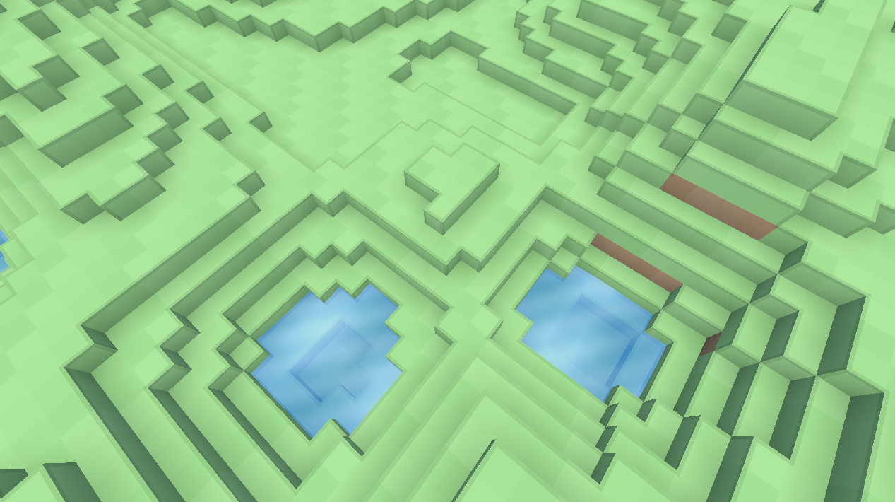

# Rutile

Rutile is a user-space graphics API built around one idea:

If a backend can do it, Rutile can expose it.

The core API is intentionally small. Backends, layers, and extensions communicate
through named procedure lookup, so new features do not need a central registry,
driver support, or official approval. A project can fork a backend, add a proc,
write a matching extension header, and load that feature from application code.

Rutile is not trying to be a sealed graphics standard. It is a workbench for
building the graphics API your project needs.

<p align="center">
  
</p>

## Project Shape

- `include/rutile.h` is the public loader and core API.
- `include/rt_ext_*.h` files are optional extension packages.
- `rt-vk13` is the Vulkan backend.
- `rt-validation` is a validation layer.
- `rt-logging-layer` is a logging layer.
- `example` is a small program that loads the backend, layers, and extensions.

## Loading

Applications load a backend by name, optionally with layers:

```c
const char* layers[] = {
    "RT_VALIDATION",
    "RT_LOGGING_LAYER",
};

rtLoad("rt-vk13", layers, 2);
if (rtError() != RT_SUCCESS) {
    /* handle load failure */
}
```

After `rtLoad`, extension headers can resolve their own procs:

```c
if (!rtLoad_RT_EXT_SWAPCHAIN()) {
    /* the loaded backend/layer chain does not support the swapchain extension */
}

if (!rtLoad_RT_EXT_GLFW()) {
    /* the loaded backend/layer chain does not support the GLFW extension */
}
```

For ad-hoc feature checks, ask the loaded chain for a proc:

```c
if (rtGetProc("rtMyFeatureDoThing")) {
    /* the loaded chain exposes this feature */
}
```

## Extensions

Rutile extensions are self-contained headers. An extension header usually owns:

- public extension types
- proc typedefs
- private proc slots
- inline API wrappers
- a `rtLoad_RT_EXT_*` function that resolves names through `rtGetProc`

The backend exposes extension functions by exporting C symbols with the same
names that the extension loader resolves:

```c
RTVK_API void rtMyFeatureDoThing(...) {
    ...
}
```

Features do not need to be registered in a table. The symbol name is the proc
name.

The application includes the extension header and loads it after the backend:

```c
#include "rt_ext_my_feature.h"

rtLoad("rt-vk13", layers, layer_count);

if (rtLoad_RT_EXT_MY_FEATURE()) {
    rtMyFeatureDoThing(...);
}
```

This is one of Rutile's core philosophies: features can be screwed onto the
API from user space. If a backend fork can implement a feature, an extension
header can expose it.

## Layers

Layers sit between the application and backend. A tableless layer gets the
downstream chain once, then exposes wrapper symbols by name:

```c
static PFN_rtMyFeatureDoThing next_rtMyFeatureDoThing;

RT_EXPORT void rtLayerSetNext(rt_proc_chain next) {
    next_rtMyFeatureDoThing =
        (PFN_rtMyFeatureDoThing)next.get_proc(&next, "rtMyFeatureDoThing");
}

RT_EXPORT void rtMyFeatureDoThing(...) {
    next_rtMyFeatureDoThing(...);
}
```

When resolving `rtMyFeatureDoThing`, the loader asks the downstream chain
whether the proc exists. If it does, the loader asks the layer DLL for a wrapper
symbol named `rtMyFeatureDoThing`. If the wrapper exists, the layer participates
in the call; otherwise the call passes through.

Layers do not need a proc table. Unknown names pass through to the next
resolver automatically.

Layers can log calls, validate usage, capture traces, emulate features, profile
performance, or experiment with new behavior.

Layer order is bottom-up:

```text
backend -> layers[0] -> layers[1] -> ... -> layers[N - 1] -> application
```

The last layer in the `rtLoad` list is the outermost layer and sees calls first.

Layers should only return wrappers for procs that exist downstream. Optional
and custom extension procs are normal in Rutile, so a missing downstream proc
means the layer should return `NULL` for that name rather than installing a
wrapper that cannot call anything.

## Error Model

Rutile calls report failure by writing thread-local error state. Calls that can
throw should be followed by an `rtError()` check:

```c
rtInit(features, feature_count);
if (rtError() != RT_SUCCESS) {
    const char* message = rtErrorMessage();
    rtClearError();
}
```

Destroy calls do not throw. Destroying `RT_NULL_HANDLE` is defined behavior.

## Installing

Rutile uses vcpkg manifest mode for third-party packages. Install vcpkg once,
then configure CMake with the vcpkg toolchain file:

```powershell
git clone https://github.com/microsoft/vcpkg C:\vcpkg
C:\vcpkg\bootstrap-vcpkg.bat
cmake -S . -B out\build -DCMAKE_TOOLCHAIN_FILE=C:\vcpkg\scripts\buildsystems\vcpkg.cmake
cmake --build out\build --config Debug
cmake --install out\build --config Debug --prefix out\install
```

If vcpkg already lives somewhere else, point `CMAKE_TOOLCHAIN_FILE` at that
checkout instead. For example:

```powershell
cmake -S . -B out\build -DCMAKE_TOOLCHAIN_FILE=C:\Users\lefloysi\Desktop\GameDev\vcpkg\scripts\buildsystems\vcpkg.cmake
```

The manifest in `vcpkg.json` installs:

- GLFW
- glslang
- Vulkan headers and loader
- Vulkan Memory Allocator

After install, the runnable files are placed in the install prefix:

```powershell
.\out\install\rutile-example.exe
```

The build tree can also be run directly:

```powershell
.\out\build\bin\Debug\rutile-example.exe
```

The current build produces `rt-vk13.dll`, `rt-validation.dll`,
`rt-logging-layer.dll`, and `rutile-example.exe`.

## Status

Rutile is early. The loader, layer chain, extension model, and Vulkan context
scaffold exist and build, but large parts of the backend are still incomplete.
The project is currently best understood as an extensible graphics API
foundation rather than a finished renderer.

## OpenGL 3.3 Parity Gaps

Rutile is deliberately smaller than OpenGL 3.3, but if the goal is to cover the
common GL 3.3 surface, the current spec is still missing a few important pieces:

- indexed drawing and index-buffer binding
- instanced drawing and per-instance vertex stepping
- viewport state
- depth/stencil test state and stencil ops
- depth bias / polygon offset
- color write masks
- primitive topology selection
- geometry-shader support
- sampler compare mode and broader sampler state
- framebuffer completeness/status queries

The existing surface already covers the core object model:

- buffers
- textures and texture views
- framebuffer attachments
- graphics programs
- command buffers
- queues and sync points

So the next additions should mostly fill in pipeline state and draw-call
variants, not introduce a whole new resource model.
